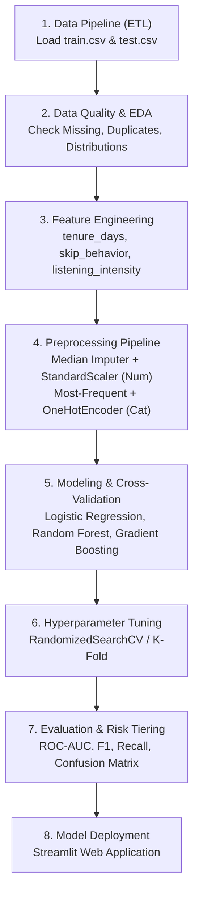

# 🎵 Streaming Subscription Churn Prediction

[](https://www.python.org/)
[](https://scikit-learn.org/)
[](https://streamlit.io/)
[](LICENSE)

> **Final Project Machine Learning** — Pengembangan solusi _End-to-End Machine Learning_ untuk memprediksi probabilitas berhenti berlangganan (_churn_) pada platform streaming musik/media, mengklasifikasikan tingkat risiko pelanggan, serta memberikan rekomendasi strategi retensi bisnis.

> **Pertanyaan utama:** _"Kalau kamu punya 125.000 pelanggan, siapa yang bakal pergi lebih dulu?"_

Alur bisnis project ini adalah **Churn Probability → Risk Tier → Retention Action**. Model memprediksi probabilitas churn, mengelompokkan pelanggan berdasarkan risiko, lalu menghubungkan hasilnya dengan tindakan retensi.

---

## 📌 1. Latar Belakang & Perumusan Masalah (Problem Scoping)

Dalam industri layanan streaming berbasis langganan (_subscription-based streaming service_), mempertahankan pelanggan aktif (_customer retention_) jauh lebih hemat biaya dibandingkan mengakuisisi pelanggan baru (_customer acquisition_). Pelanggan yang berhenti berlangganan (_churn_) menyebabkan penurunan pendapatan berulang (_recurring revenue_) secara langsung.

### 🎯 Tujuan Proyek

1. **Prediksi Akurat**: Membangun model klasifikasi _Machine Learning_ yang andal untuk memprediksi probabilitas pengguna akan melakukan _churn_ (`churned = 1`).
2. **Segmentasi Risiko**: Mengelompokkan pelanggan ke dalam 3 tingkatan risiko (_Low_, _Medium_, _High Risk_).
3. **Rekomendasi Aksi Bisnis**: Memberikan arahan tindakan retensi yang terpersonalisasi sebelum pelanggan benar-benar membatalkan langganan.
4. **Deployable Web App**: Menyediakan aplikasi web interaktif berbasis **Streamlit** untuk pengujian prediksi mandiri (single customer) maupun massal (batch CSV upload).

---

## 📊 2. Ringkasan Dataset & Fitur

Dataset mencakup perilaku penggunaan, profil akun, dan interaksi pengguna:

| Kategori Fitur         | Nama Kolom                                                                                               | Deskripsi                                                                                             |
| :--------------------- | :------------------------------------------------------------------------------------------------------- | :---------------------------------------------------------------------------------------------------- |
| **Identitas**          | `customer_id`                                                                                            | ID unik pelanggan (dihapus saat pemodelan)                                                            |
| **Demografi**          | `age`, `location`                                                                                        | Usia pelanggan dan wilayah geografis                                                                  |
| **Perilaku Mendengar** | `weekly_hours`, `average_session_length`, `song_skip_rate`, `weekly_songs_played`, `weekly_unique_songs` | Jam dengar mingguan, durasi sesi rata-rata, rasio lewati lagu, jumlah lagu yang diputar & lagu unik   |
| **Aktivitas Sosial**   | `num_favorite_artists`, `num_platform_friends`, `num_playlists_created`, `num_shared_playlists`          | Jumlah artis favorit, teman platform, playlist yang dibuat & dibagikan                                |
| **Interaksi Akun**     | `num_subscription_pauses`, `notifications_clicked`, `customer_service_inquiries`, `signup_date`          | Frekuensi jeda langganan, notifikasi yang diklik, tingkat pertanyaan customer service, tanggal daftar |
| **Paket & Pembayaran** | `subscription_type`, `payment_plan`, `payment_method`                                                    | Tipe langganan (Free/Family/Premium/Student), paket pembayaran (Monthly/Yearly), metode bayar         |
| **Target**             | `churned`                                                                                                | Status churn (`1` = Berhenti, `0` = Tetap Aktif)                                                      |

---

## ⚙️ 3. Alur Kerja End-to-End Pipeline



### 🔬 Rincian Tahapan:

1. **Data Cleaning & Audit**: Memastikan tidak ada _data leakage_, penanganan nilai anomali/ekstrem, dan validasi duplikasi.
2. **Feature Engineering**:
   - `tenure_days`: Masa aktif pelanggan dalam hari dihitung dari `signup_date`.
   - `skip_behavior`: Kategorisasi perilaku lewati lagu (_Low_, _Moderate_, _High Skip_).
   - `listening_intensity`: Rasio lagu yang diputar terhadap durasi sesi mendengarkan.
3. **Preprocessing Pipeline**: Integrasi imputasi dan encoding dalam `sklearn.pipeline.Pipeline` agar bebas dari kebocoran data (_leakage-free_).
4. **Model Benchmark & Tuning**:
   - Algoritma: **Logistic Regression** (Baseline Linier), **Random Forest**, dan **Gradient Boosting Classifier**.
   - Optimasi hyperparameter menggunakan **RandomizedSearchCV dengan 8 iterasi**.
   - Benchmark dan validasi menggunakan pemisahan data terstratifikasi serta evaluasi **ROC-AUC**, F1-Score, precision, recall, dan accuracy.
   - Konfigurasi jumlah fold harus mengikuti nilai yang dijalankan di notebook; saat ini notebook menggunakan `StratifiedKFold(n_splits=3)`.
5. **Klasifikasi Tingkat Risiko (_Risk Tiering_)**:
   - 🟢 **Low Risk** ($P < 0.30$): Pertahankan _engagement_ reguler.
   - 🟡 **Medium Risk** ($0.30 \le P < 0.70$): Kampanye rekomendasi konten terpersonalisasi.
   - 🔴 **High Risk** ($P \ge 0.70$): Penawaran promo retensi, diskon loyalitas, dan resolusi proaktif via Customer Service.

---

## 📁 4. Struktur Repositori

```text
streaming-subscription-churn-model/
├── .streamlit/
│   └── config.toml                  # Konfigurasi tema Streamlit
├── data/
│   └── sample_test_200_customers.csv # Data contoh untuk prediksi batch
├── models/
│   ├── churn_model.pkl               # Pipeline model terlatih
│   └── metrics.pkl                   # Metrik validasi model
├── src/
│   ├── __init__.py
│   ├── preprocessing.py              # Feature engineering dan preprocessing
│   └── train.py                      # Training dan export model
├── app.py                            # Aplikasi web Streamlit
├── Final_Project_ML_Soni.ipynb       # Notebook analisis dan eksperimen
├── train.csv                         # 125.000 baris dengan target
├── test.csv                          # 75.000 baris tanpa target
├── requirements.txt                  # Daftar dependensi
└── README.md                         # Dokumentasi project
```

---

## 🚀 5. Panduan Instalasi & Penggunaan

### Prasyarat

- Python `3.9` atau versi yang lebih baru
- Git

### Langkah Instalasi

1. **Clone Repositori:**

   ```bash
   git clone https://github.com/username/streaming-subscription-churn-model.git
   cd streaming-subscription-churn-model
   ```

2. **Buat & Aktifkan Virtual Environment:**
   - **Windows (PowerShell):**
     ```powershell
     python -m venv venv
     .\venv\Scripts\Activate.ps1
     ```
   - **macOS / Linux:**
     ```bash
     python3 -m venv venv
     source venv/bin/activate
     ```

3. **Install Dependensi:**

   ```bash
   pip install -r requirements.txt
   ```

4. **Menjalankan Jupyter Notebook:**

   ```bash
   jupyter notebook Final_Project_ML_Soni.ipynb
   ```

5. **Menjalankan Aplikasi Streamlit:**
   ```bash
   streamlit run app.py
   ```
   Aplikasi akan terbuka otomatis di browser pada alamat `http://localhost:8501`.

---

## 🌐 6. Fitur Aplikasi Streamlit

- 📱 **Single Prediction**: Input profil pelanggan individual secara interaktif melalui form intuitif, langsung mendapatkan skor probabilitas, kartu status risiko, dan rekomendasi tindakan retensi.
- 📁 **Batch Prediction**: Unggah berkas data pelanggan (`.csv`) untuk memproses ratusan hingga ribuan data sekaligus dengan tombol ekspor hasil prediksi.
- 📈 **Model & Business Insights**: Visualisasi ringkas faktor-faktor pemicu churn (_Feature Importance_) dan interpretasi matriks performa model.

### Menjalankan training ulang

Jika model belum tersedia atau ingin membuat ulang artefak model:

```bash
python -m src.train
```

Perintah tersebut membaca `train.csv`, melatih pipeline, lalu menyimpan `models/churn_model.pkl` dan `models/metrics.pkl`.

---

## 🛠️ 7. Pustaka & Teknologi yang Digunakan

- **Bahasa Pemrograman**: [Python 3.9+](https://www.python.org/)
- **Data Manipulation & Visualisasi**: `pandas`, `numpy`, `matplotlib`, `seaborn`
- **Machine Learning**: `scikit-learn`, `joblib`
- **Deployment & Web UI**: `streamlit`

---

## 👥 8. Kontributor

- **Nama Peserta**: Soni
- **Program**: Google Developer Groups (GDG) — Final Project Machine Learning
