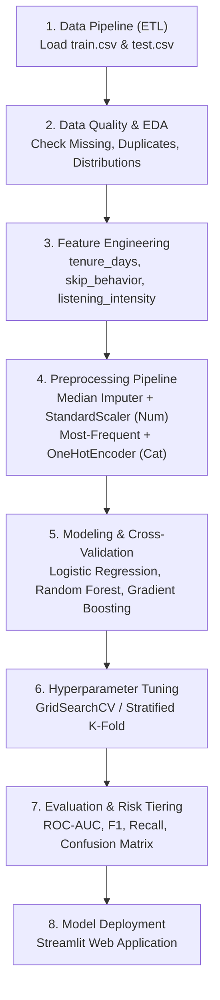

# 🎵 Streaming Subscription Churn Prediction

[](https://www.python.org/)
[](https://scikit-learn.org/)
[](https://streamlit.io/)
[](LICENSE)

> **Final Project Machine Learning** — Pengembangan solusi *End-to-End Machine Learning* untuk memprediksi probabilitas berhenti berlangganan (*churn*) pada platform streaming musik/media, mengklasifikasikan tingkat risiko pelanggan, serta memberikan rekomendasi strategi retensi bisnis.

---

## 📌 1. Latar Belakang & Perumusan Masalah (Problem Scoping)

Dalam industri layanan streaming berbasis langganan (*subscription-based streaming service*), mempertahankan pelanggan aktif (*customer retention*) jauh lebih hemat biaya dibandingkan mengakuisisi pelanggan baru (*customer acquisition*). Pelanggan yang berhenti berlangganan (*churn*) menyebabkan penurunan pendapatan berulang (*recurring revenue*) secara langsung.

### 🎯 Tujuan Proyek
1. **Prediksi Akurat**: Membangun model klasifikasi *Machine Learning* yang andal untuk memprediksi probabilitas pengguna akan melakukan *churn* (`churned = 1`).
2. **Segmentasi Risiko**: Mengelompokkan pelanggan ke dalam 3 tingkatan risiko (*Low*, *Medium*, *High Risk*).
3. **Rekomendasi Aksi Bisnis**: Memberikan arahan tindakan retensi yang terpersonalisasi sebelum pelanggan benar-benar membatalkan langganan.
4. **Deployable Web App**: Menyediakan aplikasi web interaktif berbasis **Streamlit** untuk pengujian prediksi mandiri (single customer) maupun massal (batch CSV upload).

---

## 📊 2. Ringkasan Dataset & Fitur

Dataset mencakup perilaku penggunaan, profil akun, dan interaksi pengguna:

| Kategori Fitur | Nama Kolom | Deskripsi |
| :--- | :--- | :--- |
| **Identitas** | `customer_id` | ID unik pelanggan (dihapus saat pemodelan) |
| **Demografi** | `age`, `location` | Usia pelanggan dan wilayah geografis |
| **Perilaku Mendengar** | `weekly_hours`, `avg_session_length`, `song_skip_rate`, `weekly_songs_played`, `weekly_unique_songs` | Jam dengar mingguan, durasi sesi rata-rata, rasio lewati lagu, jumlah lagu yang diputar & lagu unik |
| **Aktivitas Sosial** | `num_fav_artists`, `num_friends`, `playlists_created`, `shared_playlists` | Jumlah artis favorit, teman platform, playlist yang dibuat & dibagikan |
| **Interaksi Akun** | `subscription_pauses`, `notif_clicked`, `cs_inquiries`, `signup_date` | Frekuensi jeda langganan, notifikasi yang diklik, komplain ke customer service, tanggal daftar |
| **Paket & Pembayaran** | `sub_type`, `payment_plan`, `payment_method` | Tipe langganan (Free/Basic/Premium), paket pembayaran (Monthly/Annual), metode bayar |
| **Target** | `churned` | Status churn (`1` = Berhenti, `0` = Tetap Aktif) |

---

## ⚙️ 3. Alur Kerja End-to-End Pipeline



### 🔬 Rincian Tahapan:
1. **Data Cleaning & Audit**: Memastikan tidak ada *data leakage*, penanganan nilai anomali/ekstrem, dan validasi duplikasi.
2. **Feature Engineering**:
   - `tenure_days`: Masa aktif pelanggan dalam hari dihitung dari `signup_date`.
   - `skip_behavior`: Kategorisasi perilaku lewati lagu (*Low*, *Moderate*, *High Skip*).
   - `listening_intensity`: Rasio lagu yang diputar terhadap durasi sesi mendengarkan.
3. **Preprocessing Pipeline**: Integrasi imputasi dan encoding dalam `sklearn.pipeline.Pipeline` agar bebas dari kebocoran data (*leakage-free*).
4. **Model Benchmark & Tuning**:
   - Algoritma: **Logistic Regression** (Baseline Linier), **Random Forest**, dan **Gradient Boosting Classifier**.
   - Optimasi Hyperparameter menggunakan **Stratified 5-Fold Cross Validation** dengan fokus utama pada metrik **ROC-AUC** dan **F1-Score**.
5. **Klasifikasi Tingkat Risiko (*Risk Tiering*)**:
   - 🟢 **Low Risk** ($P < 0.30$): Pertahankan *engagement* reguler.
   - 🟡 **Medium Risk** ($0.30 \le P < 0.70$): Kampanye rekomendasi konten terpersonalisasi.
   - 🔴 **High Risk** ($P \ge 0.70$): Penawaran promo retensi, diskon loyalitas, dan resolusi proaktif via Customer Service.

---

## 📁 4. Struktur Repositori

```text
streaming-subscription-churn-model/
├── .streamlit/
│   └── config.toml                  # Konfigurasi tema Streamlit
├── data/
│   ├── train.csv                    # Dataset pelatihan dengan target
│   └── test.csv                     # Dataset pengujian tanpa target
├── models/
│   └── tuned_churn_model.pkl        # Artefak model pipeline terlatih
├── notebooks/
│   ├── Final_Project_ML_Soni.ipynb  # Notebook analisis & eksperimen lengkap
│   └── Final_Project_ML_Soni_AUDITED.ipynb
├── src/
│   ├── __init__.py
│   └── utils.py                     # Helper transformasi fitur & praproses
├── app.py                           # Aplikasi web Streamlit (Production)
├── requirements.txt                 # Daftar dependensi pustaka Python
├── README.md                        # Dokumentasi resmi proyek
└── LICENSE                          # Lisensi proyek
```

---

## 🚀 5. Panduan Instalasi & Penggunaan

### Prasyarat
- Python `3.9` atau versi yang lebih baru
- Git

### Langkah Instalasi

1. **Clone Repositori:**
   ```bash
   git clone https://github.com/username/streaming-subscription-churn-model.git
   cd streaming-subscription-churn-model
   ```

2. **Buat & Aktifkan Virtual Environment:**
   - **Windows (PowerShell):**
     ```powershell
     python -m venv venv
     .\venv\Scripts\Activate.ps1
     ```
   - **macOS / Linux:**
     ```bash
     python3 -m venv venv
     source venv/bin/activate
     ```

3. **Install Dependensi:**
   ```bash
   pip install -r requirements.txt
   ```

4. **Menjalankan Jupyter Notebook:**
   ```bash
   jupyter notebook notebooks/Final_Project_ML_Soni.ipynb
   ```

5. **Menjalankan Aplikasi Streamlit:**
   ```bash
   streamlit run app.py
   ```
   Aplikasi akan terbuka otomatis di browser pada alamat `http://localhost:8501`.

---

## 🌐 6. Fitur Aplikasi Streamlit

- 📱 **Single Prediction**: Input profil pelanggan individual secara interaktif melalui form intuitif, langsung mendapatkan skor probabilitas, kartu status risiko, dan rekomendasi tindakan retensi.
- 📁 **Batch Prediction**: Unggah berkas data pelanggan (`.csv`) untuk memproses ratusan hingga ribuan data sekaligus dengan tombol ekspor hasil prediksi.
- 📈 **Model & Business Insights**: Visualisasi ringkas faktor-faktor pemicu churn (*Feature Importance*) dan interpretasi matriks performa model.

---

## 🛠️ 7. Pustaka & Teknologi yang Digunakan

- **Bahasa Pemrograman**: [Python 3.9+](https://www.python.org/)
- **Data Manipulation & Visualisasi**: `pandas`, `numpy`, `matplotlib`, `seaborn`
- **Machine Learning**: `scikit-learn`, `joblib`
- **Deployment & Web UI**: `streamlit`

---

## 👥 8. Kontributor

- **Nama Peserta**: Soni
- **Program**: Google Developer Groups (GDG) — Final Project Machine Learning
